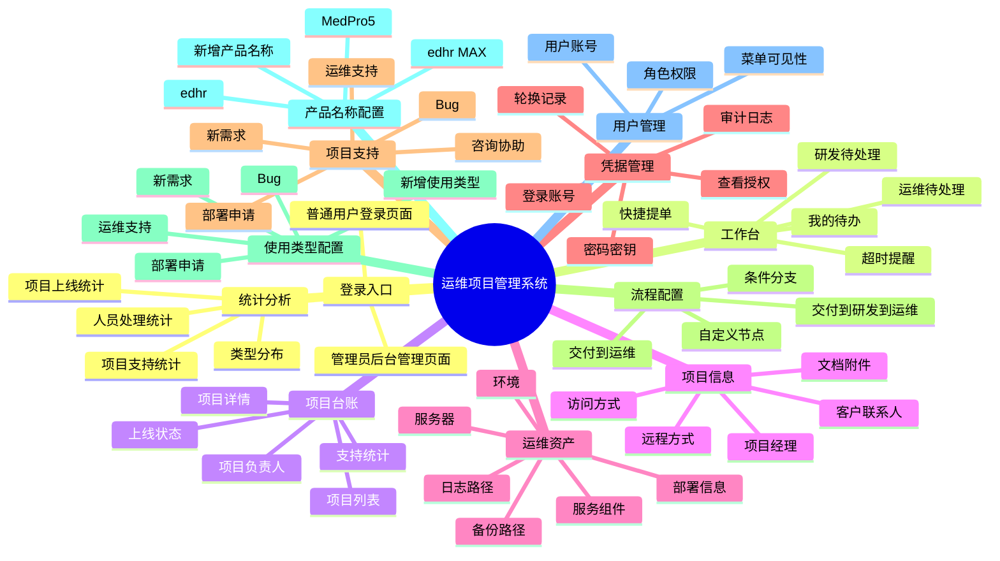
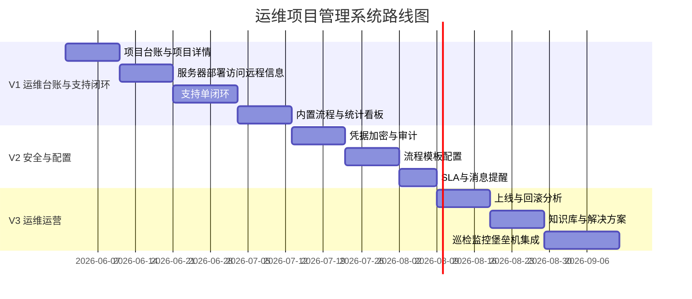

# 运维项目管理系统产品方案

## 1. 产品定位

本产品是面向运维团队的项目管理与支持协作平台，核心是帮助运维人员掌握每个项目的上线状态、服务器资产、部署方式、访问方式、远程方式、账号凭据和支持处理情况。

一句话定位：

> 以运维项目台账为中心，把交付、研发、运维之间的支持协作变成可配置、可追踪、可统计的闭环。

## 2. 目标用户与痛点

| 用户 | 典型痛点 | 产品解决方式 |
| --- | --- | --- |
| 运维管理员 | 项目信息散、服务器和密码难统一管理 | 运维项目台账、资产信息、凭据权限与审计 |
| 运维人员 | 交付支持请求多，问题来源和优先级不清 | 支持单队列、项目上下文、SLA 和处理记录 |
| 交付人员 | 部署、环境、Bug、新需求只能靠聊天催 | 统一提单、流程流转、状态可见 |
| 研发人员 | 哪些问题需要研发介入不清楚 | 交付 -> 研发 -> 运维流程、研发待办 |
| 项目经理 | 不清楚项目上线情况和支持压力 | 项目看板、上线统计、支持统计 |
| 管理层 | 无法评估运维工作量和项目稳定性 | 项目维度、人员维度、类型维度报表 |

## 3. 产品目标

- 运维目标：让运维接手任何项目时都能快速找到服务器、部署、访问、账号和联系人信息。
- 协作目标：交付提出的部署、运维支持、Bug、新需求都通过支持单闭环处理。
- 流程目标：支持“交付 -> 运维”“交付 -> 研发 -> 运维”和其他可配置流程。
- 统计目标：能按客户统计支持情况，并按项目查看上线情况、处理效率和未闭环风险。
- 安全目标：各种登录方式和密码统一纳管，加密保存，授权查看，完整审计。

## 4. 核心场景

### 场景一：运维接手项目

运维管理员创建项目台账，录入客户名称、产品名称、项目经理、交付负责人、研发负责人、运维负责人。远程方式、服务器、部署方式、访问方式和账号凭据在运维资产和客户凭证管理中维护。

### 场景二：交付提交部署申请

交付人员选择项目，提交部署申请，填写版本、部署环境、期望上线时间、部署包地址、变更说明和回滚方案。系统按“交付 -> 运维”流程进入运维待办，运维处理后回到交付确认。

### 场景三：交付提交 Bug 或新需求

交付人员提交 Bug 或新需求，系统按“交付 -> 研发 -> 运维”流程流转。研发判断并处理后，如果需要部署或配置变更，流转给运维执行；完成后交付验证关闭。

### 场景四：运维处理线上问题

运维人员收到访问异常、服务器故障、数据库问题、证书到期等支持单，进入项目详情查看服务器、部署路径、日志路径、访问地址和凭据权限，处理后记录原因、方案和影响范围。

### 场景五：项目经理查看项目状态

项目经理进入项目看板，查看上线状态、最近上线记录、未关闭支持单、Bug 数、新需求数、超时数、处理人分布和高优先级问题。

## 5. 信息架构

## 6. 页面方案

### 6.1 运维工作台

主要内容：

- 我的待办：待接收、待处理、待验证、即将超时。
- 客户支持情况：按客户汇总部署、运维支持、Bug、新需求。
- 支持概览：今日新增、处理中、超时、高优先级。
- 上线记录：登记项目版本、环境、部署结果、回滚说明、关联支持单。
- 工作台不提供搜索和新增入口，避免普通用户在首页误操作。

普通用户默认仅可见：

- 工作台。
- 项目台账。
- 项目支持。

管理员后台默认可见：

- 后台首页。
- 项目台账。
- 项目支持。
- 流程配置。
- 产品名称配置。
- 使用类型配置。
- 用户管理。
- 客户凭证管理。
- 运维资产。

### 6.2 项目台账

筛选条件：

- 项目状态、上线状态、运维负责人、项目经理、客户、产品/服务。
- 客户量较大时，项目台账提供可输入筛选：快速搜索、客户名称、产品/服务、负责人、上线状态均可直接输入；输入内容会匹配已存在的客户、产品、负责人和项目状态，快速缩小列表。

列表字段：

- 客户名称、项目、项目经理、上线状态、支持。

可见性：

- 项目台账所有普通用户可见。
- 涉及客户凭证、账号、密码、密钥等敏感信息时，只有授权用户或管理员可查看。
- 上线状态和相关负责人信息由运维管理员或项目创建者维护，其他普通用户只读。

### 6.3 项目详情

建议采用标签页：

- 概览：负责人、上线状态、支持统计、最近动态。
- 项目信息：客户、产品/服务、项目经理、交付负责人、研发负责人、运维负责人。
- 服务器：服务器 IP、用途、环境、系统、配置、到期时间。
- 部署：部署方式、部署目录、启动停止命令、日志路径、备份路径、版本记录。
- 访问：系统地址、后台地址、API 地址、监控地址、内外网访问方式。
- 凭据：账号、密码、密钥、Token，默认脱敏，按权限查看。
- 支持：部署申请、运维支持、Bug、新需求、咨询协助。
- 上线：上线记录、版本、部署人、结果、回滚记录。
- 文档：部署文档、运维手册、客户资料、应急预案。

### 6.4 支持单中心

核心操作：

- 新建、接收、分派、转研发、转运维、退回、挂起、解决、确认、关闭、重开。

关键视图：

- 交付提交、运维待处理、研发待处理、待交付确认、已超时、高优先级、本项目支持。

支持单表单字段：

- 客户名称、产品名称、支持类型、标题、问题描述、环境、服务器、版本、优先级、期望完成时间、附件、影响范围。
- 客户名称为必填且为首个字段。
- 客户名称只能从已有客户中选择。
- 产品名称根据所选客户自动筛选；如果客户有多个产品或多套项目服务，可以选择其中一个，不能填写不存在的产品或项目服务。
- 产品名称可选项来自管理员后台“产品名称配置”；新增产品名称必须通过后台维护。
- 支持类型可选项来自管理员后台“使用类型配置”，默认包含部署申请、运维支持、Bug、新需求。
- 环境固定为：生产、验证、开发。

可见性：

- 普通用户默认只能看到与自己相关的客户、项目和支持单。
- 管理员可以查看所有人的支持单。

处理与通知：

- 支持单卡片展示当前处理人，便于交付、研发、运维判断问题卡在哪个环节。
- 支持单到达当前登录人时，显示处理和转办入口；未到自己时只读查看当前进度。
- 转办必须选择具体人员，转办或流转到下一位后，系统自动生成站内消息通知接收人。

### 6.5 流程配置

核心内容：

- 流程模板列表。
- 节点配置：角色、处理人规则、动作、超时时间。
- 流程适用规则：产品名称、使用类型、流程部门、优先级、客户等级；新增流程不要求填写客户名称。
- 使用类型在单独的“使用类型配置”中维护，流程配置中只能选择已有类型。
- 默认处理人员：流程可配置默认交付确认人、默认研发处理人、默认运维处理人。
- 提单选人：提交项目支持时，处理人字段不预设默认值，可在对应团队范围内选择本次支持单的处理人员；不选择时由系统按项目负责人兜底流转。
- 流程实例记录：当前节点、处理记录、流转历史。

### 6.5.1 产品名称配置

默认产品名称：

- edhr。
- edhr MAX。
- MedPro5。

管理员可以新增产品名称，新增后可用于项目台账、项目支持、客户凭证和上线记录表单；一个客户可以关联多个产品或多套项目服务。

### 6.5.2 使用类型配置

默认使用类型：

- 部署申请。
- 运维支持。
- Bug。
- 新需求。

管理员可以新增或修改使用类型，新增后可用于流程配置和项目支持表单。

### 6.6 客户凭证管理

核心内容：

- 凭据分类：服务器、数据库、应用后台、远程工具、VPN、堡垒机、第三方平台。
- 新增凭证：先检索或选择已有客户信息，运维人员可一次性录入远程方式、服务器 IP/端口/账号/密码、数据库 IP/端口/账号/密码、平台登录地址/账号/密码、责任人和已授权用户。
- 类型识别：申请和查看权限不使用“综合凭证”。系统根据填写内容自动识别具体类型，例如服务器 IP/端口/账号/密码默认识别为 SSH，数据库信息识别为数据库，平台地址识别为平台登录。
- 筛选能力：普通用户可按客户和凭证类型筛选，只对当前选中的单个凭证类型发起查看申请。
- 查看权限：普通用户默认可见凭证管理菜单，但不可新增凭证；凭证明文必须按客户、产品和凭证类型申请查看，申请默认流转到运维管理员。
- 审批闭环：运维管理员按客户、产品和凭证类型分别同意后，申请人才可在客户凭证管理和项目台账详情中查看自己有权限的该类型凭证信息。
- 权限审计：管理员可按项目凭证查看哪些用户已授权，也可按用户查看其拥有的客户、产品和凭证类型权限。
- 安全操作：查看、复制、修改、轮换、禁用。
- 审计记录：谁在什么时间因为什么支持单查看了哪个凭据。

### 6.7 用户管理

核心内容：

- 用户账号：姓名、部门、岗位、联系方式、账号状态。
- 角色权限：系统管理员、运维管理员、运维人员、交付人员、研发人员、项目经理。
- 项目范围：全部项目、负责项目、参与项目、分派问题。
- 凭证权限：不可见、申请查看、授权查看、可维护。
- 菜单权限：管理员可配置用户是否可见工作台、项目台账、项目支持、运维资产、流程配置、产品名称配置、使用类型配置、客户凭证管理、用户管理。
- 审计联动：用户查看或复制客户凭证时记录操作人、原因、支持单和客户端 IP。

## 7. 关键指标

| 指标 | 说明 |
| --- | --- |
| 项目支持总数 | 每个项目累计支持单数量 |
| 未关闭支持数 | 当前仍未关闭的支持单数量 |
| Bug 数 | 支持类型为 Bug 的数量 |
| 新需求数 | 支持类型为新需求的数量 |
| 部署支持数 | 部署申请和部署协助数量 |
| 运维支持数 | 环境、服务器、访问、配置等运维类问题数量 |
| 平均响应时长 | 创建到首次接收/处理的时间 |
| 平均解决时长 | 创建到解决的时间 |
| 超时率 | 超过 SLA 的支持单占比 |
| 上线次数 | 项目上线记录数量 |
| 上线记录数 | 项目登记的部署、更新、回滚记录数量 |
| 回滚记录数 | 项目登记为回滚的记录数量 |

## 8. MVP 优先级

| 优先级 | 功能 | 原因 |
| --- | --- | --- |
| P0 | 项目台账、项目详情 | 运维管理的核心对象 |
| P0 | 服务器、部署、访问、远程方式 | 运维接手项目必须信息 |
| P0 | 支持单闭环 | 承接交付、研发、运维协作 |
| P0 | 内置流程：交付 -> 运维 | 最常见运维支持流程 |
| P0 | 内置流程：交付 -> 研发 -> 运维 | Bug、新需求常见流程 |
| P0 | 项目支持统计、上线统计 | 管理和复盘刚需 |
| P1 | 凭据加密与授权查看 | 解决账号密码集中管理 |
| P1 | 用户管理与角色授权 | 控制交付、研发、运维的数据和凭证权限 |
| P1 | 流程模板配置 | 适配不同项目和支持类型 |
| P1 | SLA 与超时提醒 | 提升响应效率 |
| P2 | 知识库、巡检、监控集成 | 运维运营增强 |

## 9. 产品路线图

