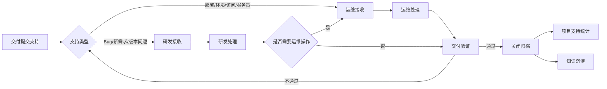
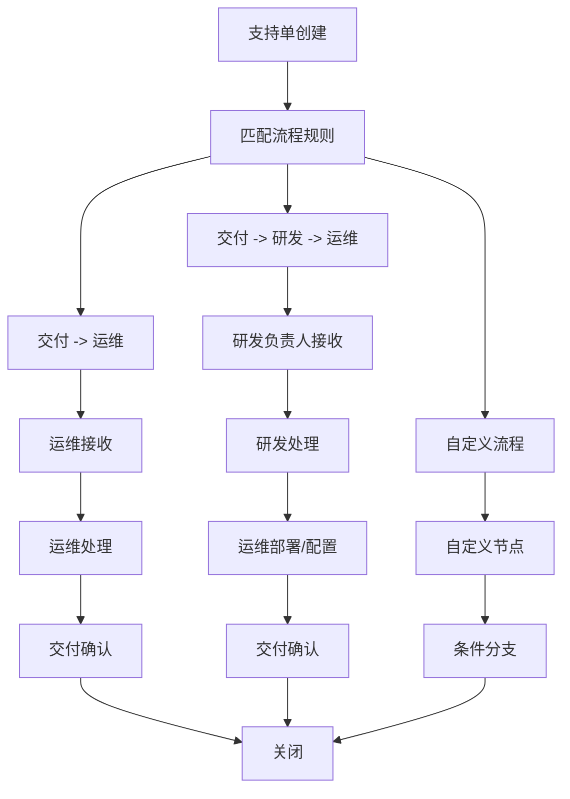
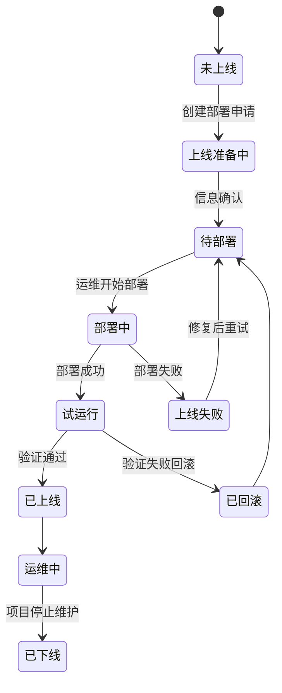
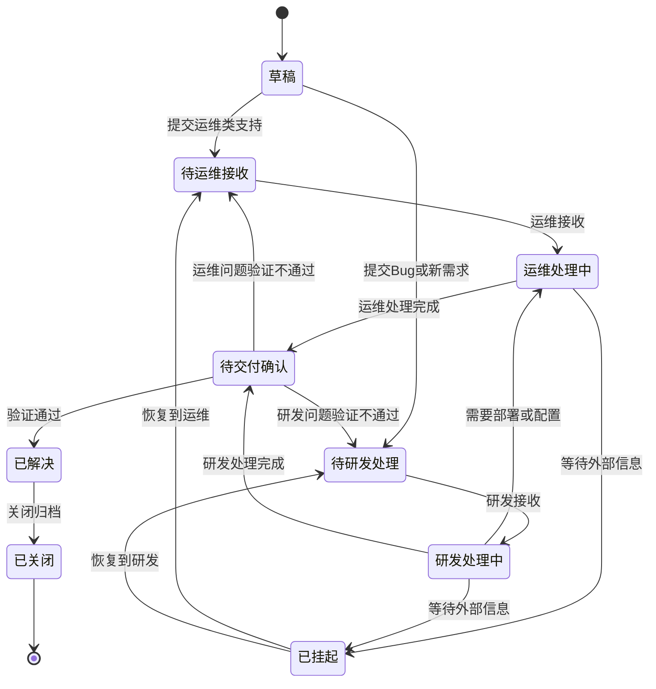
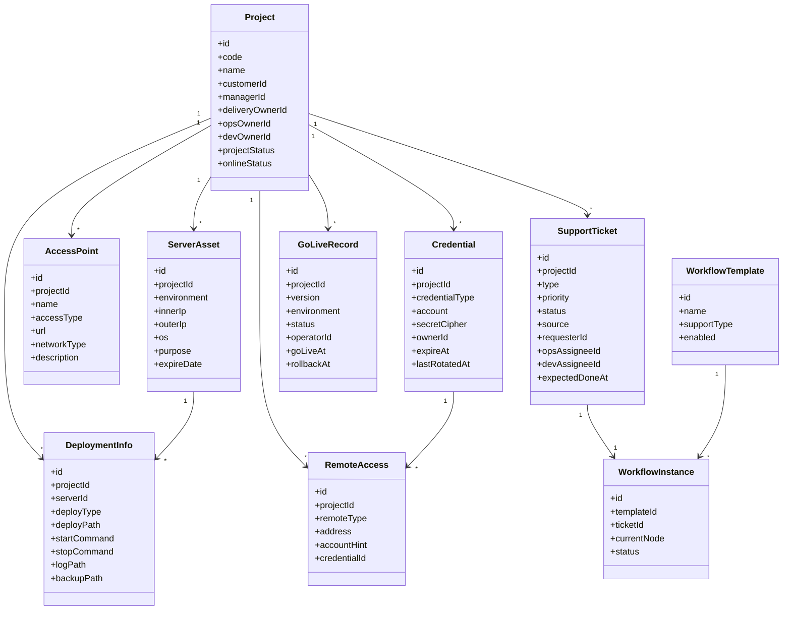
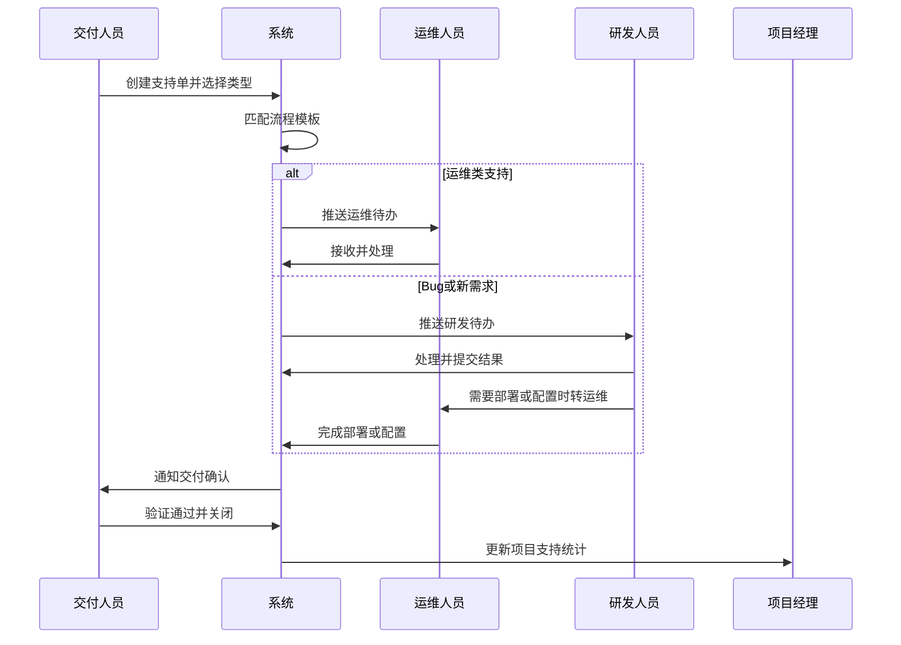
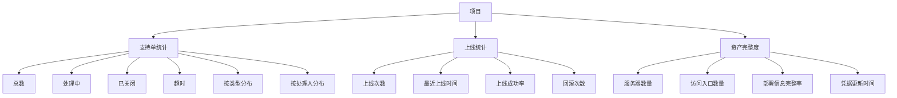
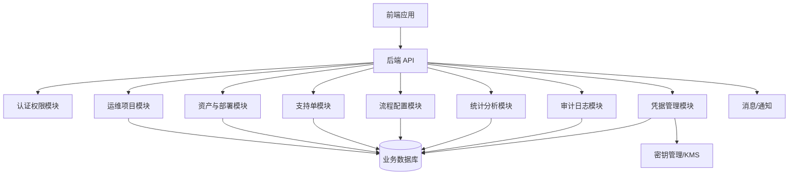

# 运维业务与数据模型

## 1. 总体业务闭环

## 2. 可配置流程模型

## 3. 项目上线状态

## 4. 支持单状态流转

## 5. 领域模型

## 6. 核心数据表

### 6.1 project 项目台账表

| 字段 | 类型 | 说明 |
| --- | --- | --- |
| id | bigint | 主键 |
| code | varchar(64) | 项目编号 |
| name | varchar(200) | 项目名称 |
| customer_name | varchar(200) | 客户名称 |
| manager_id | bigint | 项目经理 |
| delivery_owner_id | bigint | 交付负责人 |
| ops_owner_id | bigint | 运维负责人 |
| dev_owner_id | bigint | 研发负责人 |
| project_status | varchar(32) | 项目状态 |
| online_status | varchar(32) | 上线状态 |
| remote_summary | varchar(500) | 远程方式摘要 |
| deploy_summary | varchar(500) | 部署方式摘要 |
| access_summary | varchar(500) | 访问方式摘要 |
| created_at | datetime | 创建时间 |
| updated_at | datetime | 更新时间 |

### 6.2 server_asset 服务器资产表

| 字段 | 类型 | 说明 |
| --- | --- | --- |
| id | bigint | 主键 |
| project_id | bigint | 项目 ID |
| environment | varchar(32) | 环境：测试、预发、生产等 |
| inner_ip | varchar(64) | 内网 IP |
| outer_ip | varchar(64) | 外网 IP |
| hostname | varchar(128) | 主机名 |
| os | varchar(128) | 操作系统 |
| cpu | varchar(64) | CPU |
| memory | varchar(64) | 内存 |
| disk | varchar(128) | 磁盘 |
| purpose | varchar(200) | 用途 |
| expire_date | date | 到期时间 |
| remark | varchar(500) | 备注 |

### 6.3 deployment_info 部署信息表

| 字段 | 类型 | 说明 |
| --- | --- | --- |
| id | bigint | 主键 |
| project_id | bigint | 项目 ID |
| server_id | bigint | 服务器 ID |
| deploy_type | varchar(64) | 部署方式 |
| app_name | varchar(128) | 应用名称 |
| deploy_path | varchar(500) | 部署目录 |
| start_command | varchar(1000) | 启动命令 |
| stop_command | varchar(1000) | 停止命令 |
| log_path | varchar(500) | 日志路径 |
| config_path | varchar(500) | 配置路径 |
| backup_path | varchar(500) | 备份路径 |
| package_source | varchar(500) | 部署包来源 |

### 6.4 access_point 访问入口表

| 字段 | 类型 | 说明 |
| --- | --- | --- |
| id | bigint | 主键 |
| project_id | bigint | 项目 ID |
| name | varchar(128) | 入口名称 |
| access_type | varchar(32) | Web、API、管理后台、监控等 |
| url | varchar(500) | 地址 |
| network_type | varchar(32) | 内网、外网、VPN、堡垒机 |
| account_required | boolean | 是否需要账号 |
| credential_id | bigint | 关联凭据 |
| remark | varchar(500) | 备注 |

### 6.5 credential 凭据表

| 字段 | 类型 | 说明 |
| --- | --- | --- |
| id | bigint | 主键 |
| project_id | bigint | 项目 ID |
| credential_type | varchar(32) | SSH、RDP、数据库、后台、VPN、Token 等 |
| account | varchar(200) | 登录账号 |
| secret_cipher | text | 加密后的密码、密钥或 Token |
| secret_mask | varchar(200) | 脱敏展示值 |
| owner_id | bigint | 凭据责任人 |
| permission_level | varchar(32) | 查看权限级别 |
| expire_at | datetime | 过期时间 |
| last_rotated_at | datetime | 最近轮换时间 |
| status | varchar(32) | 启用、禁用、过期 |

### 6.6 support_ticket 支持单表

| 字段 | 类型 | 说明 |
| --- | --- | --- |
| id | bigint | 主键 |
| project_id | bigint | 项目 ID |
| title | varchar(200) | 标题 |
| description | text | 问题描述 |
| type | varchar(32) | 部署、运维支持、Bug、新需求、咨询 |
| priority | varchar(32) | 优先级 |
| status | varchar(32) | 状态 |
| environment | varchar(32) | 环境 |
| server_id | bigint | 关联服务器 |
| version | varchar(128) | 关联版本 |
| requester_id | bigint | 发起人 |
| ops_assignee_id | bigint | 运维处理人 |
| dev_assignee_id | bigint | 研发处理人 |
| expected_done_at | datetime | 期望完成时间 |
| first_response_at | datetime | 首次响应时间 |
| resolved_at | datetime | 解决时间 |
| closed_at | datetime | 关闭时间 |

### 6.7 go_live_record 上线记录表

| 字段 | 类型 | 说明 |
| --- | --- | --- |
| id | bigint | 主键 |
| project_id | bigint | 项目 ID |
| ticket_id | bigint | 关联部署申请 |
| version | varchar(128) | 上线版本 |
| environment | varchar(32) | 上线环境 |
| status | varchar(32) | 成功、失败、回滚 |
| operator_id | bigint | 部署人 |
| go_live_at | datetime | 上线时间 |
| rollback_at | datetime | 回滚时间 |
| rollback_reason | varchar(1000) | 回滚原因 |
| remark | varchar(1000) | 备注 |

### 6.8 credential_audit_log 凭据审计表

| 字段 | 类型 | 说明 |
| --- | --- | --- |
| id | bigint | 主键 |
| credential_id | bigint | 凭据 ID |
| project_id | bigint | 项目 ID |
| operator_id | bigint | 操作人 |
| action | varchar(32) | 查看、复制、修改、轮换 |
| reason | varchar(500) | 查看原因 |
| ticket_id | bigint | 关联支持单 |
| operated_at | datetime | 操作时间 |
| client_ip | varchar(64) | 操作 IP |

## 7. 支持单处理时序

## 8. 项目统计模型

## 9. 推荐模块边界

