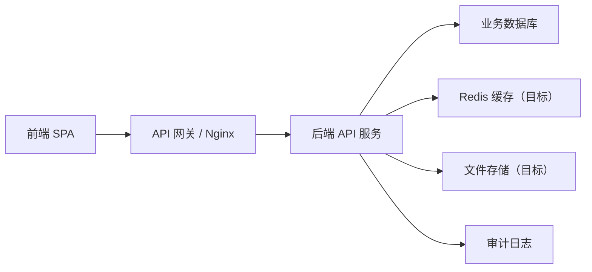

# 运维项目管理系统前后端分离开发文档

## 1. 文档目标

本文档用于指导运维项目管理系统从静态原型进入前后端分离开发阶段。系统采用前端单页应用和后端 REST API 分离架构，前端负责页面展示、交互、状态管理和表单校验，后端负责业务规则、权限控制、流程流转、凭证加密、审计日志和数据持久化。

当前原型核心范围：

- 项目台账：表格展示客户名称、产品、平台版本、上线情况、项目经理、更新详情、配置详情。
- 协同支持：客户信息、项目部署、技术支持、项目需求、其他支持。
- 配置：流程、产品名称、使用类型、客户凭证。
- 用户管理：用户、角色。
- 运维资产：服务器与环境资产信息。

## 2. 总体架构

### 2.1 架构原则

- 前后端完全分离，前端只通过 API 获取和提交数据。
- 后端不直接拼接页面，不返回 HTML 页面片段。
- 所有业务规则以后端为准，前端只做体验层校验和提示。
- 凭证、授权、审批、审计等安全逻辑必须在后端实现。
- 文件上传走独立文件服务或后端统一上传接口，数据库只保存文件元数据和访问地址。

### 2.2 技术栈

| 层级 | 方案 |
| --- | --- |
| 前端框架 | Vue 3 + TypeScript |
| 构建工具 | Vite |
| UI 组件 | Ant Design Vue 或 Element Plus，建议优先 Ant Design Vue |
| 状态管理 | Pinia |
| 路由 | Vue Router |
| 请求库 | 当前 V1 使用 Fetch API 封装；后续可按需要替换为 Axios |
| 后端框架 | FastAPI |
| ORM | SQLAlchemy 2.x |
| 数据迁移 | Alembic |
| 数据校验 | Pydantic v2 |
| 数据库 | 开发与当前 Docker Compose 默认 SQLite；生产目标 PostgreSQL |
| 缓存 | Redis 为后续目标能力，当前 V1 未接入 |
| 文件存储 | MinIO 为后续目标能力，当前 V1 未暴露通用文件接口 |
| 认证 | JWT + Refresh Token，可扩展 SSO |
| 权限 | RBAC + 数据范围 + 凭证类型授权 |
| 部署 | 当前 Docker Compose：Nginx + Vue 静态资源 + FastAPI + SQLite 文件数据库；生产目标再切换 PostgreSQL/Redis/MinIO |

当前 V1 实现状态：

| 能力 | 当前状态 | 说明 |
| --- | --- | --- |
| API 前缀 | 已实现 `/api` | 当前没有启用 `/api/v1` 版本前缀 |
| 项目部署 | 已支持多产品 | 部署单使用 `productIds`，同时保留首产品 `productTypeId` 兼容旧字段 |
| 运维资产 | 已支持只读查询 | 部署完成后生成服务器资产，接口为 `/api/assets` |
| 通用文件服务 | 待实现 | 文档中的 `/api/files/*` 属于目标接口，当前后端未暴露 |
| 凭证授权 | 部分实现 | 已有加密、申请、审批记录和 reveal 审计；reveal 的授权校验、列表数据范围过滤仍需补齐 |

### 2.3 前后端交互



## 3. 前端开发设计

### 3.1 页面结构

| 一级菜单 | 二级菜单 | 前端路由 | 说明 |
| --- | --- | --- | --- |
| 工作台 | 无 | `/dashboard` | 待办、消息、统计概览 |
| 项目台账 | 无 | `/projects` | 项目台账表格和详情弹窗 |
| 协同支持 | 客户信息 | `/support/customers` | 查看客户、新增客户 |
| 协同支持 | 项目部署 | `/support/deployments` | 项目部署单列表和新增 |
| 协同支持 | 技术支持 | `/support/technical` | 技术支持单列表和新增 |
| 协同支持 | 项目需求 | `/support/requirements` | 项目需求单列表和新增 |
| 协同支持 | 其他支持 | `/support/others` | 其他支持单列表和新增 |
| 运维资产 | 无 | `/assets` | 服务器、环境、访问资产 |
| 配置 | 流程 | `/config/workflows` | 流程模板配置 |
| 配置 | 产品名称 | `/config/products` | 产品类型维护 |
| 配置 | 使用类型 | `/config/support-types` | 支持类型维护 |
| 配置 | 客户凭证 | `/config/credentials` | 凭证管理、授权申请、审批 |
| 用户管理 | 用户 | `/users` | 用户账号和菜单权限 |
| 用户管理 | 角色 | `/roles` | 角色和权限点配置 |

### 3.2 菜单交互

- 一级菜单支持展开和隐藏二级菜单。
- 点击一级菜单：
  - 如果当前不在该分组，展开该分组并进入默认二级菜单。
  - 如果当前已在该分组，切换二级菜单展开/隐藏。
- 二级菜单点击后切换对应页面。
- 菜单显示由后端返回的用户菜单权限控制。

### 3.3 前端模块划分

建议目录：

```text
src/
  api/
    client.ts
    index.ts
    types.ts
  components/
    DataTable/
    SearchBar/
    DetailModal/
    UploadField/
    PermissionGuard/
  layouts/
    MainLayout.vue
    LoginLayout.vue
  pages/
    dashboard/
    projects/
    support/
    assets/
    config/
    users/
  stores/
    auth.ts
    menu.ts
    dictionaries.ts
  router/
  utils/
```

### 3.4 Vue 前端工程约定

- 使用 Vue 3 Composition API。
- 所有页面和业务组件使用 TypeScript。
- API 返回类型统一放在 `src/api/types.ts` 或各业务 API 文件中。
- 表格页面统一使用 `DataTable`，查询区统一使用 `SearchBar`。
- 路由守卫从 `/api/auth/profile` 和 `/api/auth/menus` 获取当前用户与菜单权限。
- 当前 V1 不暴露通用文件上传接口；后续如接入文件服务，再统一调用目标接口 `/api/files/upload`，业务表单只保存返回的文件 ID。

### 3.5 前端通用组件

| 组件 | 职责 |
| --- | --- |
| `DataTable` | 统一表格样式、分页、排序、列宽拖拽 |
| `SearchBar` | 查询表单、重置、查询按钮 |
| `DetailModal` | 查看版本、更新、凭证等详情 |
| `UploadField` | 文件上传、文件回显、删除 |
| `PermissionGuard` | 基于权限点显示/隐藏按钮 |
| `SideMenu` | 一级/二级菜单展开收起 |

### 3.6 前端状态

- `authStore`：登录用户、Token、角色、菜单权限。
- `dictionaryStore`：产品类型、使用类型、环境、优先级。
- `menuStore`：菜单展开/收起状态。
- 业务列表优先使用页面级状态，避免全局状态过重。

## 4. 后端开发设计

### 4.1 后端模块

| 模块 | 职责 |
| --- | --- |
| 认证授权 | 登录、Token、菜单权限、接口权限 |
| 客户管理 | 客户名称、销售、客户说明 |
| 项目台账 | 项目基础信息、版本、上线情况、更新详情 |
| 协同支持 | 项目部署、技术支持、项目需求、其他支持 |
| 流程引擎 | 流程模板、节点、流转、当前处理人 |
| 凭证管理 | 凭证加密、授权查看、申请审批、审计 |
| 配置管理 | 产品名称、使用类型、字典项 |
| 用户角色 | 用户、角色、菜单、权限点 |
| 文件管理 | 目标能力：上传授权文档、附件、下载鉴权；当前 V1 尚未暴露通用文件接口 |
| 审计日志 | 凭证查看、文件下载、权限变更、敏感操作 |

### 4.2 FastAPI 工程结构

建议目录：

```text
backend/
  app/
    main.py
    core/
      config.py
      security.py
      database.py
      minio.py
    api/
      v1/
        auth.py
        customers.py
        projects.py
        support.py
        credentials.py
        config.py
        users.py
        files.py
    models/
      customer.py
      project.py
      support_ticket.py
      credential.py
      user.py
      file.py
    schemas/
      customer.py
      project.py
      support_ticket.py
      credential.py
      user.py
    services/
      workflow_service.py
      credential_service.py
      file_service.py
      permission_service.py
    repositories/
    alembic/
  tests/
```

后端约定：

- 当前 API 前缀统一为 `/api`；`/api/v1` 是后续版本化目标，当前 V1 未启用。
- SQLAlchemy 管理数据模型；开发默认 SQLite，生产可通过 `DATABASE_URL` 切换 PostgreSQL。
- Alembic 管理数据库迁移。
- Pydantic schema 区分 `Create`、`Update`、`Read`。
- MinIO 和通用文件下载鉴权为后续目标能力，当前 V1 未暴露 `/api/files/*`。
- 凭证解密只允许在服务层完成，并必须记录审计日志；当前 V1 还需要补齐 reveal 授权校验和凭证列表数据范围过滤。

### 4.3 权限模型

权限采用三层：

1. 菜单权限：控制是否可见页面。
2. 操作权限：控制新增、编辑、删除、审批、查看明文。
3. 数据权限：控制能看到哪些客户、项目、支持单、凭证。

凭证权限必须细化到：

- 客户。
- 项目或产品。
- 凭证类型：SSH、RDP、VPN、堡垒机、数据库、平台登录等。
- 授权用户。

## 5. 核心业务规则

### 5.1 项目台账

列表字段：

- 客户名称。
- 产品。
- 平台版本。
- 上线情况。
- 项目经理。
- 更新详情：按钮文案为“查看”。
- 配置详情：按钮文案为“查看”。

查看规则：

- 平台版本点击后展示具体服务版本号。
- 更新详情展示项目更新记录。
- 配置详情展示当前登录用户已授权的各种客户凭证。
- 未授权凭证不展示明文，只提示去“配置 / 客户凭证”申请。
- 不再提供单独“详情”操作列。

### 5.2 客户信息

客户信息属于协同支持二级菜单。

字段：

| 字段 | 必填 | 说明 |
| --- | --- | --- |
| 客户名称 | 是 | 客户唯一名称 |
| 销售 | 否 | 负责销售人员 |
| 客户说明 | 否 | 客户背景、网络限制、支持注意事项 |

能力：

- 查看客户列表。
- 新增客户。
- 客户资料用于项目部署、技术支持、项目需求、其他支持和客户凭证。

### 5.3 项目部署

项目部署是协同支持下的独立支持类型，类型固定为“项目部署”。

新增字段：

| 字段 | 必填 | 说明 |
| --- | --- | --- |
| 客户名称 | 是 | 从客户信息中选择 |
| 项目名称 | 是 | 手动填写部署项目名称 |
| 产品类型 | 是 | 从产品名称配置中选择 |
| 类型 | 是 | 固定为项目部署 |
| 优先级 | 是 | 高、中、低、紧急 |
| 环境 | 是 | 生产、验证、开发 |
| 授权信息上传 | 否 | 上传授权文档 |
| 授权信息填写 | 否 | 手动填写授权范围、授权人、有效期等 |
| 远程方式 | 否 | 堡垒机、VPN、RDP、SSH 等 |
| 远程方式信息 | 否 | 远程入口、账号说明、连接说明 |
| 服务器信息 | 否 | IP、端口、系统、部署目录、用途 |
| 说明 | 否 | 部署包、影响范围、期望完成时间 |

业务规则：

- 项目名称必须手动填写。
- 标题字段不显示，由系统按“项目名称 + 部署申请”自动生成标题。
- 提交后默认流转到运维管理员。
- 不显示确认人、运维处理人、研发处理人选择。
- 授权信息必须支持上传文档或手动填写，两者至少建议填写一种，是否强制由后端配置。

### 5.4 技术支持、项目需求、其他支持

这三类支持保持通用支持单逻辑，不包含项目部署专属字段。

字段：

| 字段 | 说明 |
| --- | --- |
| 项目名称 | 从已有项目/客户资料中选择 |
| 产品类型 | 从产品名称配置中选择 |
| 类型 | 固定为当前二级菜单类型 |
| 优先级 | 高、中、低、紧急 |
| 环境 | 生产、验证、开发 |
| 运维处理人 | 可选 |
| 研发处理人 | 可选 |
| 交付确认人 | 可选 |
| 标题 | 手动填写 |
| 说明 | 问题描述、需求说明、影响范围 |

流转规则：

- 技术支持默认按流程配置流转，可转运维或研发。
- 项目需求默认优先进入研发处理。
- 其他支持默认进入运维处理。
- 处理人未选择时，由后端根据流程模板、项目负责人和角色兜底分派。

### 5.5 配置

配置为一级菜单，二级菜单包括：

- 流程。
- 产品名称。
- 使用类型。
- 客户凭证。

配置项由管理员维护，前端新增表单只允许选择已配置项。

### 5.6 用户管理

用户管理为一级菜单，二级菜单包括：

- 用户。
- 角色。

角色用于配置菜单权限、操作权限和数据范围。

## 6. 数据模型设计

### 6.1 customer 客户表

| 字段 | 类型 | 说明 |
| --- | --- | --- |
| id | bigint | 主键 |
| name | varchar | 客户名称，唯一 |
| sales_name | varchar | 销售 |
| note | text | 客户说明 |
| created_at | datetime | 创建时间 |
| updated_at | datetime | 更新时间 |

### 6.2 project 项目台账表

| 字段 | 类型 | 说明 |
| --- | --- | --- |
| id | bigint | 主键 |
| customer_id | bigint | 客户 ID |
| product_type_id | bigint | 产品类型 |
| platform_version | varchar | 平台版本 |
| online_status | varchar | 上线情况 |
| project_manager_id | bigint | 项目经理 |
| created_by | bigint | 创建人 |
| created_at | datetime | 创建时间 |
| updated_at | datetime | 更新时间 |

### 6.3 project_service_version 服务版本表

| 字段 | 类型 | 说明 |
| --- | --- | --- |
| id | bigint | 主键 |
| project_id | bigint | 项目 ID |
| service_name | varchar | 服务名称 |
| version | varchar | 服务版本号 |
| remark | text | 说明 |

### 6.4 project_update_log 更新记录表

| 字段 | 类型 | 说明 |
| --- | --- | --- |
| id | bigint | 主键 |
| project_id | bigint | 项目 ID |
| version | varchar | 版本 |
| content | text | 更新内容 |
| updated_by | bigint | 更新人 |
| updated_at | datetime | 更新时间 |

### 6.5 support_ticket 协同支持单表

| 字段 | 类型 | 说明 |
| --- | --- | --- |
| id | bigint | 主键 |
| ticket_no | varchar | 支持单编号 |
| support_type | varchar | 项目部署、技术支持、项目需求、其他支持 |
| project_name | varchar | 项目名称 |
| customer_id | bigint | 客户 ID |
| product_type_id | bigint | 产品类型 ID |
| title | varchar | 标题，项目部署可系统生成 |
| priority | varchar | 优先级 |
| env | varchar | 环境 |
| description | text | 说明 |
| status | varchar | 状态 |
| current_handler_id | bigint | 当前处理人 |
| requester_id | bigint | 发起人 |
| received_by_id | bigint | 部署接收人 |
| received_at | datetime | 部署接收时间 |
| deployed_by_id | bigint | 实际部署人 |
| deployed_at | datetime | 部署完成时间 |
| created_at | datetime | 创建时间 |
| updated_at | datetime | 更新时间 |

`product_type_id` 保留首个产品，用于兼容旧接口和旧数据。项目部署涉及多个产品时，以 `support_ticket_products` 为准。

### 6.6 support_ticket_products 支持单产品关联表

| 字段 | 类型 | 说明 |
| --- | --- | --- |
| id | bigint | 主键 |
| ticket_id | bigint | 支持单 ID |
| product_type_id | bigint | 产品类型 ID |
| position | int | 产品顺序 |

该表用于项目部署的多产品申请。非部署支持单只允许选择一个本次涉及的产品。

### 6.7 deployment_extra 项目部署扩展表

| 字段 | 类型 | 说明 |
| --- | --- | --- |
| id | bigint | 主键 |
| ticket_id | bigint | 支持单 ID |
| remote_method | varchar | 远程方式 |
| remote_info | text | 远程方式信息 |
| server_info | text | 服务器信息 |
| authorization_text | text | 授权信息填写 |

### 6.8 server_assets 服务器资产表

| 字段 | 类型 | 说明 |
| --- | --- | --- |
| id | bigint | 主键 |
| ticket_id | bigint | 部署支持单 ID |
| customer_id | bigint | 客户 ID |
| project_name | varchar | 项目名称 |
| product_type_id | bigint | 产品类型 ID |
| deployed_by_id | bigint | 部署人 |
| environment | varchar | 环境 |
| inner_ip | varchar | 内网 IP |
| outer_ip | varchar | 外网 IP |
| hostname | varchar | 主机名 |
| os | varchar | 操作系统 |
| purpose | varchar | 用途 |
| deployment_version | varchar | 部署版本 |
| remark | text | 备注 |

项目部署完成时会为每个产品写入服务器资产。当前 V1 资产台账只读，通过 `/api/assets` 查询。

### 6.9 file_attachment 文件附件表（目标）

| 字段 | 类型 | 说明 |
| --- | --- | --- |
| id | bigint | 主键 |
| biz_type | varchar | 业务类型 |
| biz_id | bigint | 业务 ID |
| file_name | varchar | 原始文件名 |
| file_url | varchar | 文件地址 |
| file_size | bigint | 文件大小 |
| mime_type | varchar | 文件类型 |
| uploaded_by | bigint | 上传人 |
| uploaded_at | datetime | 上传时间 |

当前 V1 未暴露通用文件上传/下载接口，该表为后续文件服务目标设计。

### 6.10 credential 客户凭证表

| 字段 | 类型 | 说明 |
| --- | --- | --- |
| id | bigint | 主键 |
| customer_id | bigint | 客户 ID |
| product_type_id | bigint | 产品类型 |
| credential_name | varchar | 凭证名称 |
| credential_type | varchar | SSH、RDP、VPN、数据库、平台登录 |
| account | varchar | 账号 |
| encrypted_secret | text | 加密密文 |
| owner_id | bigint | 责任人 |
| rule | varchar | 查看规则 |
| created_at | datetime | 创建时间 |

### 6.11 credential_authorization 凭证授权表

| 字段 | 类型 | 说明 |
| --- | --- | --- |
| id | bigint | 主键 |
| credential_id | bigint | 凭证 ID |
| user_id | bigint | 授权用户 |
| credential_type | varchar | 授权类型 |
| approved_by | bigint | 审批人 |
| approved_at | datetime | 审批时间 |
| status | varchar | pending、approved、rejected |
| reason | text | 申请原因 |

## 7. API 设计

### 7.1 通用响应

```json
{
  "code": 0,
  "message": "success",
  "data": {},
  "traceId": "req-20260604-0001"
}
```

分页响应：

```json
{
  "code": 0,
  "message": "success",
  "data": {
    "list": [],
    "page": 1,
    "pageSize": 20,
    "total": 100
  }
}
```

### 7.2 认证与菜单

| 方法 | 路径 | 说明 |
| --- | --- | --- |
| POST | `/api/auth/login` | 登录 |
| POST | `/api/auth/logout` | 退出 |
| GET | `/api/auth/profile` | 当前用户 |
| GET | `/api/auth/menus` | 当前用户菜单树 |

### 7.3 客户信息

| 方法 | 路径 | 说明 |
| --- | --- | --- |
| GET | `/api/customers` | 客户列表 |
| POST | `/api/customers` | 新增客户 |
| GET | `/api/customers/{id}` | 客户详情 |
| PUT | `/api/customers/{id}` | 更新客户 |

新增客户请求：

```json
{
  "name": "华南医疗集团",
  "salesName": "张销售",
  "note": "私有化部署客户，远程需提前预约。"
}
```

### 7.4 项目台账

| 方法 | 路径 | 说明 |
| --- | --- | --- |
| GET | `/api/projects` | 项目台账列表 |
| POST | `/api/projects` | 新增项目台账 |
| GET | `/api/projects/{id}` | 项目台账详情 |
| GET | `/api/projects/{id}/versions` | 服务版本详情 |
| GET | `/api/projects/{id}/updates` | 更新详情 |
| GET | `/api/projects/{id}/dashboard` | 项目支持统计 |
| GET | `/api/projects/{id}/authorized-credentials` | 目标接口：已授权凭证，当前 V1 未暴露 |

### 7.5 协同支持

| 方法 | 路径 | 说明 |
| --- | --- | --- |
| GET | `/api/support-tickets` | 支持单列表 |
| POST | `/api/support-tickets` | 新增支持单 |
| PUT | `/api/support-tickets/{id}` | 更新非部署支持单；项目部署必须走专用流程 |
| GET | `/api/support-tickets/{id}` | 支持单详情 |
| POST | `/api/support-tickets/{id}/handle` | 处理非部署支持单 |
| POST | `/api/support-tickets/{id}/transfer` | 转办非部署支持单 |
| POST | `/api/support-tickets/{id}/close` | 关闭非部署支持单 |
| POST | `/api/support-tickets/{id}/receive` | 项目部署：运维 Leader 接收 |
| POST | `/api/support-tickets/{id}/assign` | 项目部署：分配部署负责人 |
| POST | `/api/support-tickets/{id}/self-assign` | 项目部署：运维 Leader 自领 |
| POST | `/api/support-tickets/{id}/complete-deployment` | 项目部署：完成部署并生成资产 |
| GET | `/api/deployment-project-options` | 查询可选部署项目、所属客户和已部署产品 |

项目部署新增请求：

```json
{
  "supportType": "项目部署",
  "customerId": 1,
  "projectName": "华东产业园生产部署",
  "productIds": [1, 2],
  "priority": "高",
  "env": "生产",
  "description": "部署 v2.8.1 版本",
  "remoteMethod": "堡垒机 / SSH",
  "remoteInfo": "堡垒机地址和连接说明",
  "serverInfo": "10.24.6.18:22 / Ubuntu / /opt/app",
  "authorizationText": "授权人：王总；有效期：2026-12-31",
  "authorizationFileIds": [1001]
}
```

项目部署支持多产品，`productIds` 至少包含一个产品 ID。后端会把首个产品同步到 `productTypeId/product_type_id`，用于兼容旧接口和旧数据。

技术支持/项目需求/其他支持新增请求：

```json
{
  "supportType": "技术支持",
  "customerId": 1,
  "projectName": "华东产业园",
  "productId": 1,
  "priority": "高",
  "env": "生产",
  "title": "客户内网无法访问管理后台",
  "description": "登录后台超时",
  "opsHandlerId": 10,
  "devHandlerId": 11,
  "deliveryHandlerId": 12
}
```

非部署支持单只允许选择一个本次涉及的产品，字段可使用 `productId`；后端兼容旧字段 `productTypeId`。

项目部署完成请求：

```json
{
  "servers": [
    {
      "environment": "生产",
      "innerIp": "10.20.30.40",
      "outerIp": "203.0.113.40",
      "hostname": "prod-app-01",
      "os": "Rocky Linux 9",
      "purpose": "应用服务",
      "deploymentVersion": "v2.8.1",
      "remark": "部署完成"
    }
  ]
}
```

也兼容直接提交单台服务器字段；多产品部署会为每个产品各生成一条服务器资产。

### 7.6 运维资产

| 方法 | 路径 | 说明 |
| --- | --- | --- |
| GET | `/api/assets` | 服务器资产分页查询 |
| GET | `/api/assets?ticketId={id}` | 按部署支持单查询资产 |

资产接口当前只读。资产由项目部署完成流程生成，响应包含部署工单、客户、项目、产品、环境、IP、主机、操作系统、用途、版本、部署人和备注。

### 7.7 文件上传（目标）

| 方法 | 路径 | 说明 |
| --- | --- | --- |
| POST | `/api/files/upload` | 目标接口：上传文件，当前 V1 未暴露 |
| GET | `/api/files/{id}` | 目标接口：下载文件，当前 V1 未暴露 |
| DELETE | `/api/files/{id}` | 目标接口：删除文件，当前 V1 未暴露 |

文件上传返回：

```json
{
  "id": 1001,
  "fileName": "授权函.pdf",
  "fileUrl": "/api/files/1001",
  "fileSize": 204800,
  "mimeType": "application/pdf"
}
```

### 7.8 配置

| 方法 | 路径 | 说明 |
| --- | --- | --- |
| GET | `/api/config/product-types` | 产品名称列表 |
| POST | `/api/config/product-types` | 新增产品名称 |
| GET | `/api/config/support-types` | 使用类型列表 |
| POST | `/api/config/support-types` | 新增使用类型 |
| GET | `/api/config/workflows` | 流程模板列表 |
| POST | `/api/config/workflows` | 新增流程模板 |

### 7.9 客户凭证

| 方法 | 路径 | 说明 |
| --- | --- | --- |
| GET | `/api/credentials` | 凭证列表，默认脱敏 |
| POST | `/api/credentials` | 新增凭证 |
| POST | `/api/credentials/{id}/apply` | 申请查看 |
| POST | `/api/credentials/{id}/approve` | 审批授权 |
| POST | `/api/credentials/{id}/reveal` | 查看明文 |
| GET | `/api/credentials/audit` | 审计日志 |

当前 V1 已记录申请、审批和 reveal 审计，但 reveal 授权校验、审批角色校验、凭证列表数据范围过滤仍需按权限模型补齐。

### 7.10 用户与角色

| 方法 | 路径 | 说明 |
| --- | --- | --- |
| GET | `/api/users` | 用户列表 |
| POST | `/api/users` | 新增用户 |
| PUT | `/api/users/{id}` | 更新用户 |
| GET | `/api/roles` | 角色列表 |
| POST | `/api/roles` | 新增角色 |
| PUT | `/api/roles/{id}` | 更新角色权限 |

## 8. 前后端职责边界

### 8.1 前端负责

- 页面布局、表格展示、弹窗、表单交互。
- 一级/二级菜单展开隐藏。
- 输入项基本校验：必填、格式、长度。
- 文件上传控件和上传进度展示。
- 根据后端权限结果隐藏不可用按钮。
- 调用 API 并处理错误提示。

### 8.2 后端负责

- 登录认证、Token 校验、接口鉴权。
- 菜单权限、操作权限、数据权限计算。
- 项目部署默认流转到运维管理员。
- 技术支持、项目需求、其他支持按流程配置分派。
- 凭证加密、解密、授权、审计。
- 文件上传鉴权、文件下载鉴权。
- 数据一致性校验和事务控制。

## 9. 安全要求

- 所有 API 必须鉴权。
- 凭证明文不得直接出现在列表接口。
- 凭证查看必须单独调用 reveal 接口，并写审计日志。
- 当前 V1 reveal 接口还需补齐授权校验：只有已审批通过、授权范围匹配的用户才能查看明文。
- 当前 V1 凭证列表还需补齐数据范围过滤：普通用户只能看到自己可见客户/项目/产品下的脱敏凭证。
- 文件下载必须校验业务权限；当前 V1 未暴露通用文件下载接口。
- 上传文件需要限制类型和大小；当前 V1 未暴露通用文件上传接口。
- 敏感接口需要记录操作人、IP、时间、业务对象。
- 删除类接口建议软删除。

## 10. 部署方案

### 10.1 开发环境

```text
frontend:   http://127.0.0.1:5175
backend:    http://127.0.0.1:8001
database:   sqlite:///./backend/dev.db
```

前端通过代理访问后端：

```text
/api -> http://127.0.0.1:8001
```

自动化 E2E 使用隔离端口：

```text
frontend: http://127.0.0.1:15175
backend:  http://127.0.0.1:18001
database: 每次测试创建临时 SQLite 文件
```

### 10.2 生产环境

```text
Nginx
  /            -> frontend dist
  /api         -> backend service
  /uploads     -> 目标：file service or backend download API

Backend
  FastAPI app service
  SQLite 文件数据库（当前 Docker Compose 默认）
  PostgreSQL / Redis / MinIO（生产目标能力）
```

## 11. 开发里程碑

### V1 基础闭环

- 登录与菜单权限。
- 客户信息。
- 项目台账表格与版本/更新/授权凭证查看。
- 协同支持四类表单与列表。
- 项目部署专属字段、多产品选择、部署接收/分配/完成闭环。
- 运维资产只读台账。
- 用户、角色基础管理。

### V2 配置与权限

- 流程配置。
- 产品名称配置。
- 使用类型配置。
- 客户凭证加密、申请、审批、查看。
- 凭证 reveal 授权校验、审批角色校验和列表数据范围过滤。
- 审计日志。
- 通用文件上传、附件下载鉴权和授权附件管理。

### V3 运营分析

- 工作台待办。
- 支持单 SLA 与超时提醒。
- 项目维度、人员维度统计。
- 运维资产与部署记录增强。
